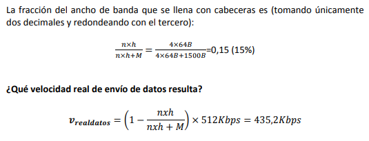

# Relación ejercicios teóricos Tema 4
### 1. Explique brevemente las funciones de cada una de las capas del modelo de comunicación de datos TCP/IP
**Capa de acceso a la red**: Interactua con el hardware(cables, routers...)
**Capa de Internet (IP):** Encargada de la transmisión de paquetes y el enrutamiento a través de múltiples redes.
**Capa de Transporte (TCP/UDP):** Asegura la comunicación punto a punto y la transferencia de datos fiable o no fiable.
**Capa de Aplicación:** Proporciona servicios de red a las aplicaciones del usuario (HTTP, FTP, SSH).
**Capa de Red (IP):** Protocolo IP (Internet Protocol), responsable de la fragmentación y el direccionamiento de paquetes.
**Capa de Transporte:**
    **TCP (Transmission Control Protocol):** Protocolo orientado a la conexión, garantiza la entrega
    de los paquetes.
    **UDP (User Datagram Protocol):** Protocolo sin conexión, más rápido, pero sin garantías de
    entrega.
**Capa de Aplicación:** Protocolos como HTTP (web), FTP (transferencia de archivos), SSH (conexión
remota), SMTP (correo electrónico).

### 2. Si la unidad de datos de protocolo en la capa de enlace se llama trama y la unidad de datos de protocolo en la capa de red se llama paquete, ¿son las tramas las que encapsulan los paquetes o son los paquetes los que encapsulan las tramas? Explicar la respuesta.
Las de tramas encapsula a las de red, ya que la capa de enlace esta mas abajo que el de la de red.

### 5. ¿Qué diferencia, en el contexto de una red de computadores, existe entre la tecnología de difusión y la tecnología punto a punto? y fuera del contexto de redes de computadores, dime 2 ejemplos de comunicaciones por difusión y otros dos de punto a punto
La de punto a punto es para un ordenador en especifico y la de difusion es lo mismo pero llega un mensaje a todos los dispositivos y ya el sabe si va para el o no y asi saber si escuchar o no.

### 6. Un sistema tiene una jerarquía de protocolos de n capas. Las aplicaciones generan mensajes de M bytes de longitud. En cada capa se añade una cabecera de h bytes. ¿Qué fracción del ancho de banda de la red se llena con cabeceras? Aplique el resultado a una conexión a 512 Kbps con tamaño de datos de 1500 Bytes y 4 capas, cada una de las cuales añade 64 Bytes de cabecera. La fracción del ancho de banda que se llena con cabeceras es (tomando únicamente dos decimales y redondeando con el tercero):

### 8. Cuando se intercambia un fichero entre dos hosts se pueden seguir dos estrategias de confirmación. En la primera, el fichero se divide en paquetes que se confirman individualmente por el receptor, pero el fichero en conjunto no se confirma. En la segunda, los paquetes individuales no se confirman individualmente, es el fichero entero el que se confirma cuando llega completo. Discutir las dos opciones
En la primera opcion si falla algun paquete solo tienes que volver a enviar ese paquete, mientras que en la otra opcion si falla el archivo tienes que enviar el archivo completo, entonces es el doble de datos.

### 9. Clasifique como difusión o punto a punto cada uno de los siguientes sistemas de transmisión: a. Radio y TV b. Redes inalámbricas (WLAN) c. ADSL d. Redes de Cable. e. conexión WIFI

### 10. Clasifique los siguientes servicios como orientados a conexión / no orientados a conexión y confirmados /sin confirmación. Justifique la respuesta. a. Correo postal ordinario b. Correo certificado c. Envío y recepción de fax d. Conversación telefónica
no orientado a conexion y no confirmado, no orientado a conexion y confirmado, orientado a conexion y confirmado, orientado a conexion y confirmado, no orientado a conexion y confirmado, no orientado a conexion y confirmado.

# Ejercicio extra:
### 7. ¿Cuál es el tiempo necesario en enviar un paquete de 1000 Bytes, incluidos 50 Bytes de cabecera, por un enlace de 100 Mbps y 10Km? ¿cuál es el tiempo mínimo desde que se envía hasta que se recibe confirmación? ¿qué relación hay entre este tiempo y los temporizadores en, por ejemplo, las capas de enlace y transporte?